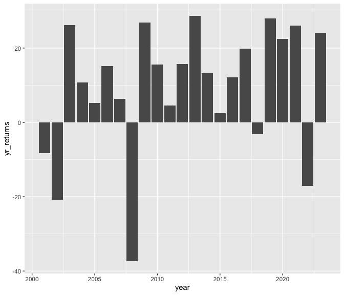

wk2-workshop
================
Shae-Anne
2024-01-24

- [Read in data](#read-in-data)
- [Statistics](#statistics)
- [Plot: S&P Prices](#plot-sp-prices)
- [Plot: S&P Yearly Returns](#plot-sp-yearly-returns)

## Read in data

``` r
df = readRDS("data/wk2_stocks.rds")
head(df)
```

    ##   SPY_prices  SPY_returns  SPY_vol       date
    ## 1   88.06087  0.048035622 88.06087 2001-01-03
    ## 2   87.11300 -0.010763872 87.11300 2001-01-04
    ## 3   84.26933 -0.032643418 84.26933 2001-01-05
    ## 4   84.92164  0.007740723 84.92164 2001-01-08
    ## 5   84.69744 -0.002640050 84.69744 2001-01-09
    ## 6   86.18548  0.017568856 86.18548 2001-01-10

## Statistics

- The cumulative returns of the S&P index during this period is 218.33%.
- The average daily returns of the S&P index during this period is
  0.04%.
- The standard deviation of the daily returns of the S&P index during
  this period is 1.22%.

## Plot: S&P Prices

``` r
library(tidyverse)
```

    ## ── Attaching core tidyverse packages ──────────────────────── tidyverse 2.0.0 ──
    ## ✔ dplyr     1.1.1     ✔ readr     2.1.4
    ## ✔ forcats   1.0.0     ✔ stringr   1.5.0
    ## ✔ ggplot2   3.4.2     ✔ tibble    3.2.1
    ## ✔ lubridate 1.9.2     ✔ tidyr     1.3.0
    ## ✔ purrr     1.0.1     
    ## ── Conflicts ────────────────────────────────────────── tidyverse_conflicts() ──
    ## ✖ dplyr::filter() masks stats::filter()
    ## ✖ dplyr::lag()    masks stats::lag()
    ## ℹ Use the conflicted package (<http://conflicted.r-lib.org/>) to force all conflicts to become errors

``` r
ggplot(data = df, aes(x = date, y = SPY_prices)) +
  geom_line()
```

<!-- -->

## Plot: S&P Yearly Returns

``` r
df %>% 
  mutate(year = year(date)) %>%
  filter(year <= 2023) %>%
  group_by(year) %>%
  summarize(yr_returns = sum(SPY_returns)*100) %>%
  ggplot(aes(x = year, y = yr_returns)) + 
  geom_col()
```

<!-- -->
